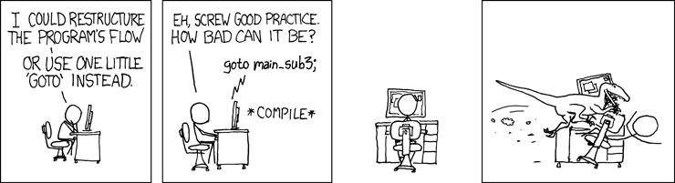

# 🎯 Comando GOTO em C - Uso e Limitações

## 📖 Conceito

Este projeto demonstra o **comando `goto`** em C, uma instrução controversa que permite saltos incondicionais no código. Embora útil em casos específicos, é geralmente desencorajado devido aos problemas de legibilidade e manutenção que pode causar.



## 🎯 Objetivos de Aprendizado

- Entender como funciona o comando `goto`
- Compreender labels e saltos incondicionais
- Aprender quando usar (e quando **não usar**) `goto`
- Conhecer alternativas mais estruturadas
- Entender o conceito de "spaghetti code"

## 💻 Implementação Atual

```c
#include <stdio.h>

int main(){
    start:                    // Label (rótulo)
    
    printf("Going to start\n");
    
    goto start;              // Salto para o label
    
    return 0;               // Nunca executado!
}
```

### ⚠️ **CUIDADO**: Este código cria um **loop infinito**!

## 🔄 Como Funciona

### Anatomia do GOTO
1. **Label**: `start:` - Define um ponto de destino
2. **Comando**: `goto start;` - Salta para o label
3. **Fluxo**: Execução continua a partir do label

### Fluxo de Execução
```
1. Programa inicia
2. Encontra label "start:"
3. Executa printf()
4. Executa goto start
5. Volta para o label
6. Executa printf() novamente
7. Loop infinito...
```

## 🚨 Problemas do Código Atual

### 1. Loop Infinito
O programa nunca termina, imprimindo infinitamente:
```
Going to start
Going to start
Going to start
...
```

### 2. Código Inalcançável
```c
return 0;  // Esta linha nunca será executada
```

### 3. Consumo de Recursos
- CPU em 100%
- Saída infinita no terminal
- Necessário Ctrl+C para parar

## 🛠️ Versões Melhoradas

### 1. GOTO com Controle
```c
#include <stdio.h>

int main() {
    int count = 0;
    
    start:
    printf("Iteration %d\n", ++count);
    
    if (count < 5) {
        goto start;
    }
    
    printf("Done!\n");
    return 0;
}
```

### 2. GOTO para Tratamento de Erro
```c
#include <stdio.h>
#include <stdlib.h>

int main() {
    FILE *file1 = NULL, *file2 = NULL;
    
    file1 = fopen("input.txt", "r");
    if (!file1) {
        printf("Error opening input.txt\n");
        goto cleanup;
    }
    
    file2 = fopen("output.txt", "w");
    if (!file2) {
        printf("Error opening output.txt\n");
        goto cleanup;
    }
    
    // Processar arquivos...
    printf("Files processed successfully\n");
    
cleanup:
    if (file1) fclose(file1);
    if (file2) fclose(file2);
    return 0;
}
```

## 🔍 Casos de Uso Legítimos

### ✅ Quando GOTO é Aceitável:

1. **Cleanup de Recursos**
2. **Saída de Loops Aninhados**
3. **Máquinas de Estado Simples**

## ❌ Alternativas Estruturadas

### Use loops, funções e flags em vez de GOTO sempre que possível

## 📚 História e Contexto

### "GOTO Considered Harmful"
- **Artigo famoso** de Edsger Dijkstra (1968)
- Argumentou contra uso indiscriminado de GOTO
- Promoveu programação estruturada

## 🎓 Conceitos Demonstrados

- **Controle de Fluxo**: Saltos incondicionais
- **Labels**: Pontos de destino no código
- **Loop Infinito**: Construções que nunca terminam
- **Spaghetti Code**: Código difícil de seguir
- **Programação Estruturada**: Alternativas ao GOTO

## 💡 Boas Práticas

### ✅ Faça:
- Use GOTO apenas para cleanup
- Mantenha saltos curtos e para frente
- Documente o uso de GOTO
- Considere alternativas primeiro

### ❌ Evite:
- GOTO para lógica complexa
- Saltos para trás (podem criar loops)
- Uso excessivo de labels

## 📚 Material de Referência

_Spaghetti code [site](https://en.wikipedia.org/wiki/Spaghetti_code)_

**Lição**: GOTO é uma ferramenta poderosa, mas com grandes poderes vêm grandes responsabilidades. Use com sabedoria!