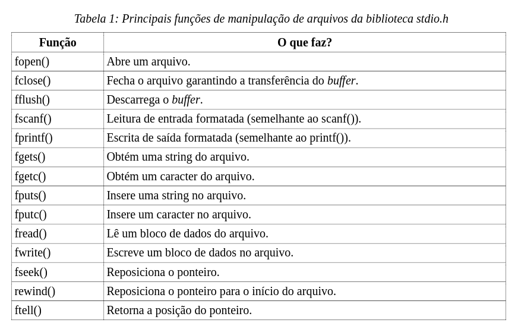

# Files (Create)

### Manipulação de arquivos



### fprintf x fputs

```c
    fprintf(fPtr, "Este é um número formatado: %d\n", 42);
    fputs("Esta é uma string simples.\n", fPtr);
```

Reference material:

https://codeforwin.org/c-programming/c-program-create-file-write-contents <br>
http://wiki.icmc.usp.br/images/8/82/Manipulacao_arquivos.pdf